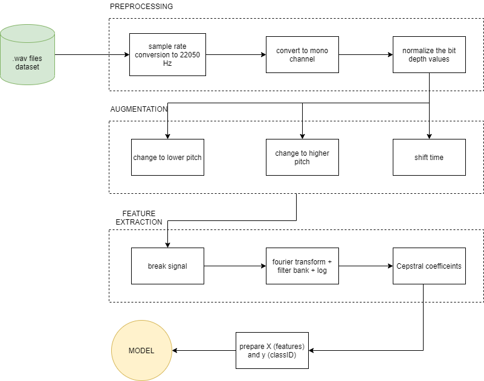

# Siren Detection with Ensemble Learning
This project aimed to train models to perform classification on 10 classes with best accuracies and precision. We implemented seven different classifier models to determine which one fits the dataset features most accurately. The audio wave files were converted to mel frequency cepstral coefficients (MFCC) for feature extraction. 

## Dataset
[UrbanSound8K Dataset](https://urbansounddataset.weebly.com/urbansound8k.html)

The target classes are:

- 0 - Air conditioner
- 1 - Car horn
- 2 - Children playing
- 3 - Dog bark
- 4 - Drilling
- 5 - Engine idling
- 6 - Gun shot
- 7 - Jackhammer
- 8 - Siren
- 9 - Street music

## Observations
| MODEL  | ACCURACY | ACCURACY WITH AUGMENTATION |
| ------------- | ------------- | ------------- |
| Convolutional Neural Network with images   | 11.792  | -  |
| Fully Connected Neural Network  | 86.777   | 97.123   |
| Convolutional Neural Network with MFCC  | 90.097   | 99.127   |
| Decision Tree Classifier   | 67.258   | 88.277  |
| Random Forest Classifier  | 65.369   | 91.068  |
| XGBoost Classifier  | 75.902   | 74.921  |
| Stacked Classifier   | 87.979   | 98.340  |

## Design Diagram

